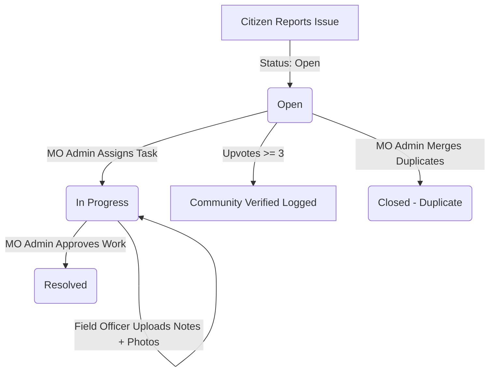

# Civiverse — Civic Feedback & Municipal Response Platform

Civiverse is a modern, full-stack platform designed to bridge the gap between local citizens and municipal authorities. It enables citizens to report civic infrastructure issues (potholes, broken streetlights, water leaks, etc.), rewards active community participation, and provides municipal offices and field officers with powerful tools to manage, assign, track, and resolve tasks.

---

## 🌟 Key Features

### 1. Citizen Portal
* **Interactive Dashboard:** View active civic issues on a local map, track overall resolution rates, and view personalized statistics.
* **Frictionless Reporting:** Report issues with geo-coordinates, street addresses, severity selections, category classifications, and photo evidence.
* **Community Verification:** Upvote issues to validate reports. If an issue gets 3 or more upvotes, the platform automatically appends a `"Community verified"` status node to the timeline.
* **Feed & Social Dialogue:** Post comments, view timelines, and collaborate with neighbors on ongoing local issues.
* **City Pulse (Insights):** Select any municipal office city to view dynamically aggregated charts on issue categories, average resolution times, and active report statistics.
* **Rewards Vault:** Earn XP and points by actively reporting issues, posting comments, or upvoting neighbors' reports. Earn badges (e.g. *Citizen Patrol*, *Eco-Warrior*, *Pothole Sentinel*, *Civic Champion*) and climb local leaderboards.

### 2. Field Officer (Employee) Portal
* **Amber-Badge Workspace:** Dedicated workspace with a yellow `"Field Officer"` tag. Only displays assigned tasks, hiding citizen-focused rewards, pulses, and reporting tabs.
* **Geo-Location Maps:** A map showing pinned pins of only the issues currently assigned to the specific officer.
* **Field Work Updates:** Open any assigned task, input progress notes, capture/upload work photos directly from a mobile camera or gallery, and toggle status between `"Open"` and `"In Progress"`.
* **Exempt from XP:** Field officers are excluded from earning XP, points, and appearing on citizen leaderboards.

### 3. Municipal Office (MO) Admin Portal
* **City-Scoped Management:** Admins log in under city office accounts (e.g. `mo-ghaziabad`, `mo-noida`) and automatically filter all issues, staff lists, and statistics to their respective city boundaries.
* **Staff Panel:** Add, track, and manage field officers in their departments (Roads, Water, Lighting, Waste, etc.).
* **Task Assignment:** Choose an active issue, select a department employee from a dropdown, and assign the task. This automatically shifts the status to `"In Progress"` and writes an assignment tracking entry to the timeline.
* **Incident Deduplication & Merge:** Auto-detect duplicate reports of the same incident (same city, same category, within 200 meters). Admins can click **Merge** on the overlay alert banner to consolidate the reports:
  - Consolidates unique upvoters and sums upvote counts.
  - Combines all comment history (tagging duplicate comments with `[From Duplicate Issue #...]`).
  - Automatically transitions the duplicate issue to status `"Duplicate"` and logs merge records in both timelines.
* **Work Approval & Resolution:** MO Admins review uploaded work photos and notes from field officers, approve the resolution, and permanently close issues as `"Resolved"`.

---

## 🚀 Technology Stack

### Frontend (SPA)
* **Framework:** React 18 (Vite build system)
* **Styling:** CSS variables, Glassmorphism design system, and custom micro-animations (slide-ups, fade-ins).
* **Maps:** Leaflet maps for spatial visualization.
* **Icons:** FontAwesome v6.

### Backend (Serverless Ready)
* **Framework:** Python 3.12 (FastAPI)
* **Web Server:** Uvicorn ASGI server
* **Data Storage:** Local JSON file database (`data/users.json` and `data/issues.json`) for zero-dependency local runs. Can be easily configured to connect to cloud datastores.

---

## 📂 Project Structure

```
├── backend/
│   ├── main.py                 # FastAPI application initializer
│   ├── models.py               # Pydantic request/response schemas
│   ├── db.py                   # Thread-safe JSON database read/write controllers
│   └── routers/
│       ├── auth.py             # User signup, citizen login, and official logins
│       ├── issues.py           # Issue CRUD, comments, and employee updates
│       ├── stats.py            # Dynamic analytics engine and leaderboards
│       └── admin.py            # Staff registration, task assignments, and merges
├── data/
│   ├── users.json              # Registered accounts and roles
│   └── issues.json             # Civic issues and timeline arrays
├── frontend/
│   ├── public/                 # Static assets
│   ├── src/
│   │   ├── components/         # Shared components (Sidebar, Header, AuthOverlay)
│   │   ├── context/            # Global authentication & toast state context
│   │   ├── css/                # Custom CSS styling
│   │   ├── views/              # View screens (Dashboard, Feed, Insights, Rewards, Admin, Employee)
│   │   ├── App.jsx             # Active view routing based on roles
│   │   └── main.jsx            # React root mount
│   ├── vite.config.js          # Vite configurations (outDir directs to root public/)
│   └── package.json            # React project dependencies
├── public/                     # Compiled React static production assets
├── Dockerfile                  # Multi-stage production container configuration
└── README.md                   # Project documentation
```

---

## ⚙️ Issue Lifecycle



---

## 🛠️ Local Development Setup

### Prerequisites
* **Node.js:** v20 or higher
* **Python:** v3.12 or higher

### Step 1: Clone and install packages
```bash
# Clone the repository
git clone https://github.com/Virtual-box-KA/v2s.git
cd vibe2ship

# Install frontend dependencies
cd frontend
npm install
cd ..
```

### Step 2: Running the Application
1. **Start the FastAPI Backend:**
   In your root directory terminal, run:
   ```bash
   python -m uvicorn backend.main:app --reload --host 127.0.0.1 --port 8000
   ```
2. **Start the Frontend Development Server:**
   In a separate terminal, navigate to the `frontend/` directory and run:
   ```bash
   npm run dev
   ```
3. Open your browser and navigate to `http://localhost:5173`.

---

## ☁️ Google Cloud Platform (GCP) Deployment Guide

### Deployment via GCP Browser Cloud Shell (Recommended)

Since this project contains a production-ready multi-stage `Dockerfile` (which builds the React app, mounts it, and runs it on top of FastAPI), you can deploy it to **Google Cloud Run** in minutes directly from the browser:

#### 1. Open Google Cloud Shell
1. Log in to the [Google Cloud Console](https://console.cloud.google.com/).
2. In the top-right corner of the menu bar, click the **Activate Cloud Shell** icon (`>_`).

#### 2. Ensure Billing is Enabled
*Important:* The Cloud Shell terminal requires billing to be activated for your project to enable APIs:
1. Go to the [GCP Billing Page](https://console.cloud.google.com/billing).
2. Ensure your active project **`vibe2ship-500919`** is linked to an active Billing Account.

#### 3. Upload and Deploy
1. Click the three dots (`...`) in the Cloud Shell toolbar and click **Upload** to upload your project directory.
2. Navigate to your uploaded project in Cloud Shell:
   ```bash
   cd vibe2ship
   ```
3. Run the Cloud Run deploy command:
   ```bash
   gcloud run deploy civiverse \
       --source . \
       --region=asia-south1 \
       --allow-unauthenticated \
       --port=8080
   ```
4. Press **`y`** to enable any required Google Cloud APIs (Artifact Registry, Cloud Build, Cloud Run).
5. Once complete, copy the **Service URL** output to access your live portal!
